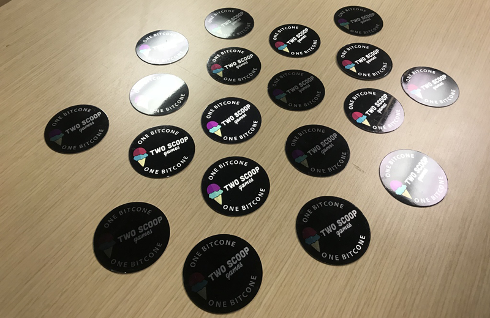

# Bitcones
### A Creamtographic currency from your friends at Two Scoop Games!

#### Bitcones in circulation: 5/20

Creamtographic currency coins for Two Scoop Games to give out at as physical tokens(with associated ids) at events and as digital currency in games/online. Soon to be redeemable for special rewards such as game download codes, swag etc.

Bitcone series one (aluminum, only 20 produced)

## Based on highly advanced ScoopChain technology

[white paper available here](https://github.com/TwoScoopGames/scoopchain/blob/master/scoopchain-whitepaper.jpg)

The ScoopChain project is home to the Bitcone currency, the creamtographic technology that runs it, and a continuously growing crowd-sourced list of real ice cream flavors.

Check back on March 2, 2018 for the launch of the Bitcone flavor validator and a secret surprise:
[http://twoscoopgames.com/Bitcone/](http://twoscoopgames.com/Bitcone/)

# How it works
## &nbsp; &nbsp; &nbsp; &nbsp; &nbsp; &nbsp; &nbsp; &nbsp; &nbsp; will work? &nbsp; &nbsp; ... could work!

## The main parts

- Bitcone - a uuid that is created by the Bitcone generator and added to a master list
  - Physical Bitcone coins - Created for handing out at events, just a transportation method for the Bitcone id, not the actual currency
- The master list - a list of valid Bitcone ids (this is not a distributed thing, master list lives on a central server)
- Validation service (takes a Bitcone id and a user's provided name or email)
  - Checks the entered Bitcone ID against the master list
  - Assigns a flavor from `flavors.json` to the Bitcone id
  - Assigns a user email to the Bitcone id
  - Creates an ScoopChain entry including Bitcone id, flavor and hashed user email
- ScoopChain - a history of all Bitcone registrations, transfers, redemptions, and metadata

## What you can do with Bitcones

Nothing yet, Bitcones are more of an investment opportunity, or for use on the darkweb

But really - think of a Bitcone like a Two Scoop Games gift card and just something fun.

- Trade Bitcones with an friend  (coming soon)
- Give a Bitcone to someone  (coming soon)
- Spend a Bitcone   (coming soon)
  - Game key to get a copy of a game
  - In-game key to unlock upgrades, items, in lieu of in-app purchase etc.

## User flow for using a Bitcone

1. User scans QR tag on the physical coin - or - User follows a pre-filled link from within one of our games after "earning" the Bitcone
2. Bitcone webpage takes the Bitcone uuid as a query string passes it to backend service
3. Backend service "licks" the Bitcone to validate it against a list on the server
4. Webpage returns a flavor to the user randomly picked from the master flavors list using the Bitcone uuid as the seed (the same Bitcone  always returns the same flavor)
5. User is given the current options for redeeming the Bitcone or can save it for use with any future offer.
